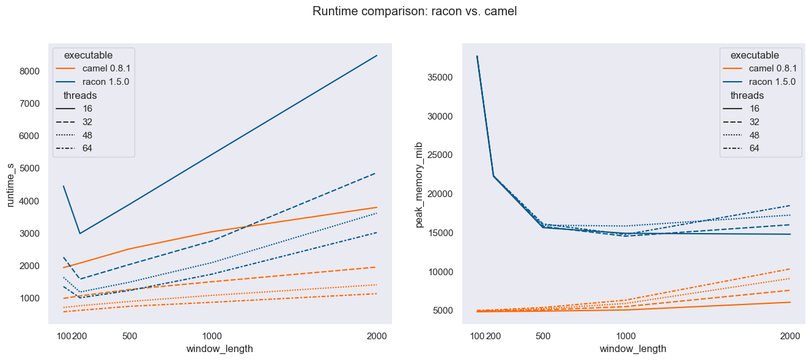
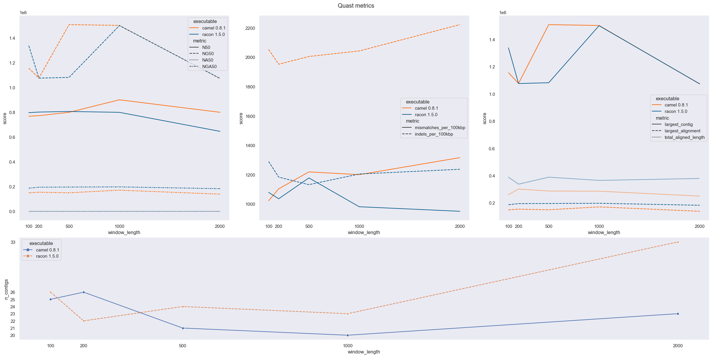

# Camel

Camel is a read correction tool based on [lbcb-sci/racon](https://github.com/lbcb-sci/racon). It drops support for MHAP/SAM file formats to achieve more aggressive parallelization lowering the runtime cost while being close in polishing quality to racon. We process multiple reads in parallel and each step of error correction is also done in parallel. As soon as supporting reads have been aligned to the target read, they are used for error correction. This differs from racon's stepwise approach where we first align all the reads, construct window, perform window local correction and concatenate results. Tasks within the racon's pipeline step are done in parallel but multiple pipeline steps are not done in parallel. Eg. you can't be aligning supporting reads to the target read while performing POA alignment for another read. This is made possible in camel by dropping MHAP/SAM support. It would be possible keep that support without performance penalty using a streaming concurrent architecture on the indexed/sorted input where all overlaps for the target read are read in one batch from memory and used immediately.

## Evaluation

We used `S288C_Nanopore_R7.fastq.gz` from [genoscope](http://www.genoscope.cns.fr/externe/Download/Projets/yeast/datasets/raw_data/S288C/) for haploid evaluation. Reads were aligned using [minimap2](https://github.com/lh3/minimap2) with `-x ava-ont` preset producing 3.2GB of overlap data. Benchmarks were ran on *AMD EPYC 7662 64-Core Processor* with DDR4-3200 working memory. To reproduce the measurements see [util/README.md](util/README.md).

### Runtime



### Quality

Corrected reads were piped into [raven 1.8.1](https://github.com/lbcb-sci/raven). Assembly was evaluated using [QUAST - Quality Assessment Tool for Genome Assemblies](https://quast.sourceforge.net/). 

#### Raven assembly with uncorrected reads

| # contigs | Largest contig | N50 | NG50 | NA50 | NGA50 | # mismatches per 100 kbp | # indels per 100 kbp | Largest alignment | Total aligned length |
|-----------|----------------|-----|------|------|-------|--------------------------|----------------------|-------------------|-------|
| 26 | 1067717 | 720383 | 720383 | - | - | 1341.19 | 3528.11 | 11661 | 46824 |

#### Camel 0.8.1 vs Racon 1.5.0


For data extraction, formatting and visualization see [reprot.ipynb](util/report.ipynb)

## Dependencies
* Clang 11.0+ (or gcc equivalent)
* CMake 3.17+
* Conan 1.52+

## Build

### Release

```properties
git clone git@github.com:tbrekalo/camel.git
cd camel

cmake -S ./ -B ./build -DCAMEL_BUILD_EXE=1 -DCMAKE_BUILD_TYPE=Release
cmake --build build
```

### Development

```properties
cmake -S ./ -B ./build_Debug -DCAMEL_BUILD_TESTS=1 -DCAMEL_BUILD_EXE=1 -DCAMEL_DEVEL_OPTS=1 -G="Ninja" -DCMAKE_EXPORT_COMPILE_COMMANDS=1 -DCMAKE_BUILD_TYPE=Debug


cmake -S ./ -B ./build_RelWithDebInfo -DCAMEL_BUILD_TESTS=1 -DCAMEL_BUILD_EXE=1 -DCAMEL_DEVEL_OPTS=1 -G="Ninja" -DCMAKE_EXPORT_COMPILE_COMMANDS=1 -DCMAKE_BUILD_TYPE=RelWithDebInfo

cmake --build <target_dir>
```

### Instalation
Camel is still under development. Installation support will be available from 1.0. For now, make sure that executable is in your can be found in your path.


## Development raodmap

* evaluate on diploid datasets
* integrate custom mapper in camel for lower memory footprint
* resolve an issue with read quality
  * why camel corrected reads have worst mismatch/indle statistic than racon ones
  